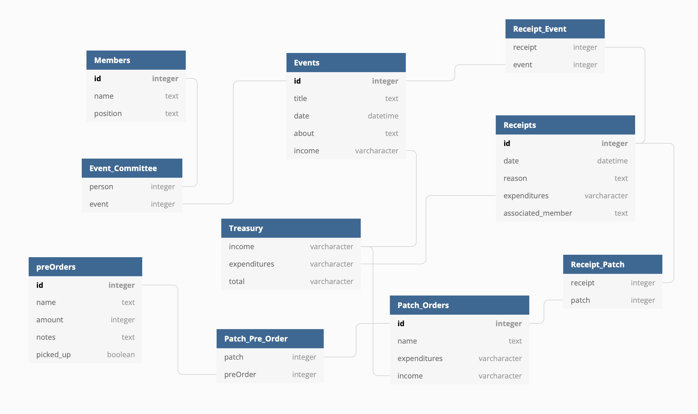

# 1 ROPS Booster Club App

## Schema

## Database
With a database, the 1 ROPS booster club will be able to keep track of income and expenditures and provide a platform for planning big events. The booster club can utilize the information in the database to help provide a healthy continuity for future members.

## Routes
* GET /1rops: will send back all events.
* GET /1rops/{event}: will send back specific details of event.
* GET /1rops/members: will send back list of members.
* GET /1rops/patches: will retrieve a list of patch orders.
* GET /1rops/money: will retrieve total amount of money the booster club has.
* GET /1rops/event/{eventId}: will let you retrieve net income for an event.
* GET /1rops/patches/{patchId}: will let you retrieve net income for a patch.
* GET /1rops/preorder: will grab all of the preOrders in database.
* GET /1rops/receipts: will grab all of the receipts within the database.
* GET /1rops/preorder/{patchId}: will grab all pre-orders correlating to a specific patch.
* PATCH /1rops/{event}: will update date or income based off of input.
* PATCH /1rops/members/{memberId}: will allow you to change member position.
* PATCH /1rops/patches/{patchId}: will allow you to update amount of patches sold and amount made for each patch.
* PATCH /1rops/reorder/{patchId}: will allow you to update number of patches order for a patch and will input new receipt as well as update treasury.
* PATCH /1rops/preorder/{pre-orderId}: will allow you to update whether or not patches have been picked up or update the desired amount of patches.
* POST /1rops: will let you post new events, this route will also update treasury.
* POST /1rops/{event}: will allow you to post new receipts for events with reason, expenditures, and associated_member parameters.
* POST /1rops/members: will allow you to register new member with name and position parameters.
* POST /1rops/patches: will allow you to add new patch orders and receipts for orders.
* POST /1rops/preorder: will allow you to add a new pre-order into the system.
* DELETE /1rops/members/{memberId}: will allow you to delete member from booster club.

## Leaning Tool
This project will also act as a good learning device, providing the steps necessary to create a full stack app
1. npm init -y
2. npm install express pg knex
3. knex init
4. npm install jest supertest --save-dev
5. npm install cors morgan nodemon --save
6. make sure to touch an app.js and update JSON to include proper start and test scripts **start script:** "start": "nodemon app.js" **test script:** "test": "NODE_ENV:development jest"
7. start with creating a good README.md with a well structured plan of what you want to provide the user from the backend and the routes to do so
8. If you are using Docker to store your data prior to deployment, open Docker app and run the container in which you will be storing your data. Will be utilizing the Postgres image in this app. Steps to set up and run a postgres container:
    * docker pull postgres
    * docker run --name (name of container) -e POSTGRES_PASSWORD=(password) -d -p 5432:5432 -v $HOME/docker/volumes/postgres:/var/lib/postgresql/data postgres
        * if docker container is already created: docker run (container name)
    * docker exec -it (container name) /bin/bash, you are now in the shell of your container
    * psql -U postgres, running your image in your container
    * Now in your container you can CREATE DATABASE (database name) or \c into a database. To view tables when in a database: \d or to look at a specific table \dt (table name)
    * When done, ^C to escape out
9. Look into setting up knex and express app in the respective folders
10. Be sure to create a gitHub repository to save your work, commit often! To create repository, go to [GitHub]('https://github.com').